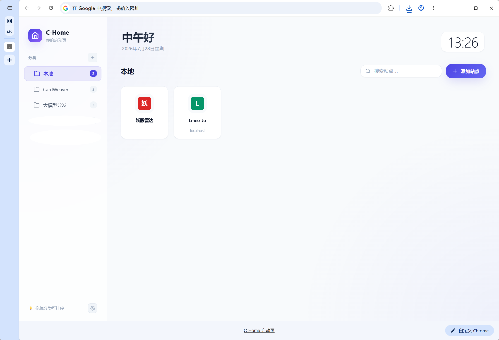
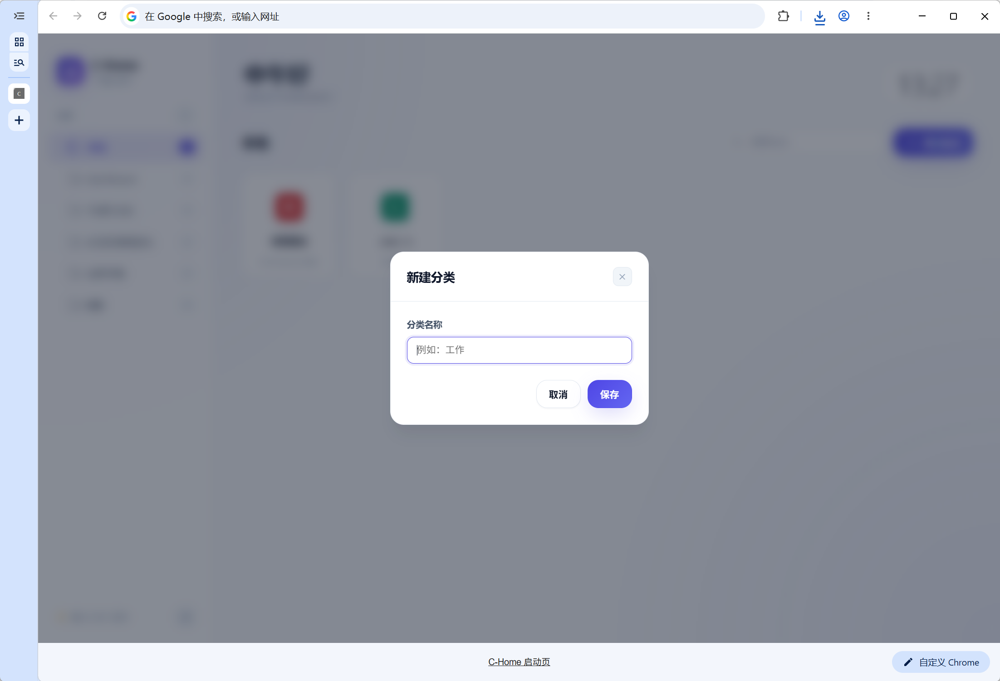
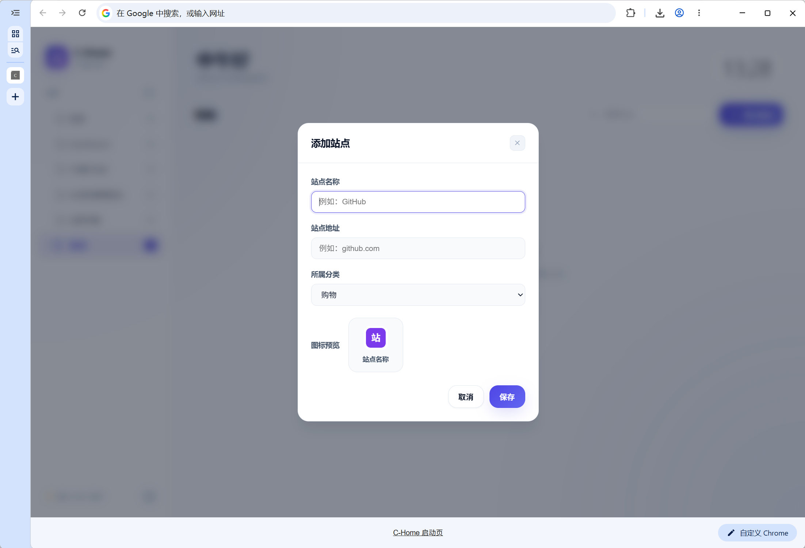
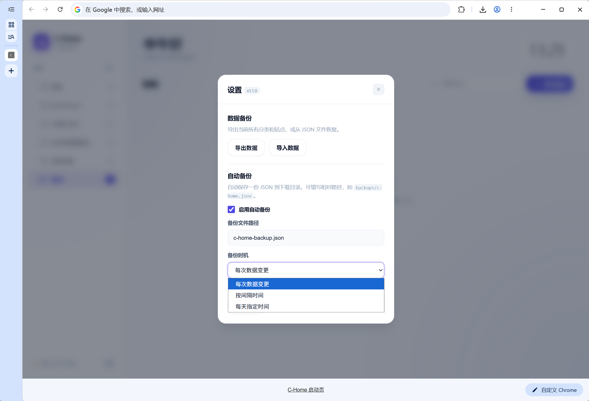
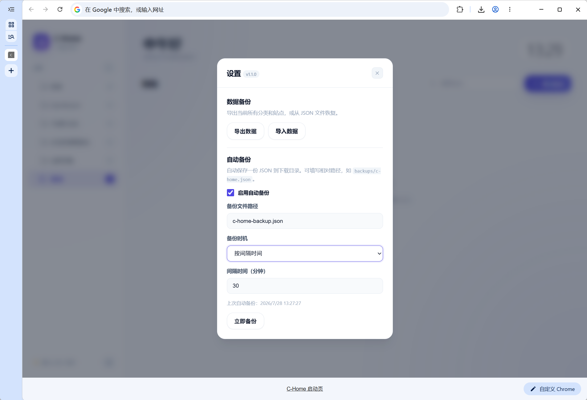

# C-Home 启动页

> 自定义 Chrome 新标签页，让常用站点井井有条。

C-Home 是一个干净、现代、零依赖的 Chrome 扩展，用来替换默认新标签页。它把常用站点按分类组织在卡片网格中，支持流畅的拖拽排序、多后端云同步、图标自定义与自动备份。

## 亮点

- **多后端存储，多选并存** - IndexedDB 本地大容量 + Chrome 同步 + WebDAV + GitHub Gist 任意组合，数据同时写入所有勾选位置
- **本地先行渲染** - 启动毫秒级读本地数据立即渲染，云端后台竞速按时间戳 last-write-wins 自动换上最新数据，云端再慢也不白屏
- **远端写入不阻塞 UI** - 所有远端后端走后台防抖队列（1.5s 合并、串行、15s 超时），增删改拖拽全部即时响应
- **分类与站点图标自定义** - 分类支持自定义颜色 + 8 种内置图标 / Emoji / 上传图片；站点支持自定义图标颜色与 Emoji/图片，上传自动压缩到 128×128
- **FLIP 拖拽排序** - 占位符 + FLIP 动画，拖拽时其他卡片平滑让位，支持跨分类拖拽迁移
- **非阻断 Toast 提示** - 操作反馈用堆叠 Toast（5 秒消失、可带操作按钮），不再打断操作流程
- **Chrome 同步配额预警** - 用量达 80% 提前提醒、写满引导切换存储方案，支持「今日不提示」「不再提示」
- **现代化的 UI/UX** - 玻璃拟态侧边栏、indigo/violet 渐变主色、卡片进入动画、自适应深色模式
- **零外部依赖** - 纯原生 JavaScript，Chrome Extension Manifest V3

## 功能

- **站点管理**：添加、编辑、删除常用站点，自动获取 Favicon；支持自定义图标颜色与 Emoji/图片图标
- **分类组织**：创建、重命名、删除分类；分类支持自定义颜色、内置图标、Emoji、上传图片；删除分类时站点自动迁移到默认分类
- **拖拽排序**：站点卡片和分类列表均可拖拽调整顺序，支持跨分类拖拽迁移
- **站点搜索**：在当前分类下按名称或地址搜索站点
- **多后端存储**：IndexedDB 本地 / Chrome 同步 / WebDAV / GitHub Gist 多选并存，数据同时写入所有勾选位置
- **配额预警**：Chrome 同步用量达 80% 提前提醒，写满时引导切换存储方案
- **导入导出与自动备份**：支持 JSON 手动备份/恢复，自动备份可选「每次变更」「按间隔」「每日指定时间」三种策略
- **Toast 提示**：非阻断堆叠式操作反馈，支持操作按钮（如「去设置」「今日不提示」）
- **深色模式**：跟随系统 `prefers-color-scheme` 自动切换
- **实时时钟问候**：顶部显示当前时间、日期，并根据时段自动切换问候语

## 安装

1. 打开 Chrome，进入 `chrome://extensions`
2. 开启右上角「开发者模式」
3. 点击「加载已解压的扩展程序」，选择本项目目录
4. 打开新标签页即可使用

## 项目结构

```
c-home/
├── manifest.json        # Chrome 扩展清单
├── newtab.html          # 新标签页入口
├── css/style.css        # 样式（含深色模式）
├── js/app.js            # 应用逻辑
├── config/settings.json # 云端配置开发参考模板（运行时不读取）
├── pics/                # 界面截图
├── PLAN.md              # 存储方案设计文档
├── AGENTS.md            # AI 代理规则
└── .claude/CLAUDE.md    # Claude 配置
```

## 截图

| 主界面 | 新建分类 |
| :---: | :---: |
|  |  |

| 添加站点 | 设置 - 备份时机 |
| :---: | :---: |
|  |  |

| 设置 |
| :---: |
|  |

> 注：设置页已重构为标签页布局（数据存储 / 云端配置 / 备份与恢复），截图待更新。

## 技术栈

- 纯原生 JavaScript（ES5 语法，兼容扩展环境）
- Chrome Extension Manifest V3
- CSS 变量实现亮色/深色模式
- HTML5 Drag and Drop API + FLIP 动画实现拖拽排序
- IndexedDB + chrome.storage + fetch（WebDAV/Gist API）

## 数据说明

数据默认保存在本机 **IndexedDB**（容量可达磁盘级，远大于 `chrome.storage.local` 的 10MB），并在首次使用时请求 `navigator.storage.persist()` 持久化以避免被浏览器回收。存储位置**支持多选**，数据会同时写入所有勾选的后端：

- **IndexedDB 本地**：大容量，仅本机；换设备需导出备份或勾选云端后端。
- **Chrome 同步**：跟随 Google 账号跨设备，约 100KB 限制，适合小数据。
- **WebDAV 云端**：保存到你自己的 WebDAV 网盘，容量无墙、跨设备。需在「设置 - 云端配置」填写地址与凭证。
- **GitHub Gist**：轻量云备份（单文件约 1MB 限制）。需填写 Token。

**启动读取策略**：快通道（sync / local）毫秒级先行渲染；慢通道（cloud / gist）后台竞速拉取，按数据内的 `updatedAt` 时间戳 last-write-wins--云端更新则应用并重渲染，更旧则本地回写云端自愈。云端再慢也不阻塞开页。

**写入策略**：本地 IndexedDB 同步等待（毫秒级）；sync / cloud / gist 走后台防抖队列（1.5s 合并、串行、15s 超时），不阻塞 UI 操作。云端写失败时数据不丢（本地已落盘，全量快照下次同步自愈）。

可任意组合（如「IndexedDB + WebDAV」本地大容量 + 云端备份，或「IndexedDB + 同步」等）。从旧版本（`chrome.storage.local` / `sync`）升级时，会自动把旧数据迁移到当前后端，不会丢失。

云端凭证仅保存在本机 `chrome.storage.local`，不会上传。

无论使用哪种存储方式，移除扩展都会清空本地数据。建议定期通过「设置 -> 导出数据」备份，或开启自动备份到下载目录。仓库内 `config/settings.json` 仅为开发参考模板，扩展运行时不读取。

## 更新日志

详见 [GitHub Releases](https://github.com/karoc/c-home/releases)。

## License

[MIT](./LICENSE)
